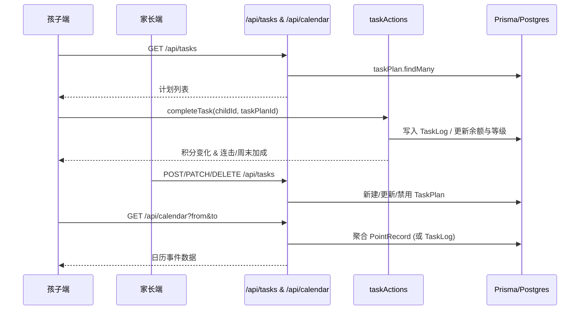

# 日历与计划任务模块（Calendar & Tasks）——设计说明与源码索引

本文档聚焦“学习计划/日历”相关的数据模型、接口、前端组件与服务端逻辑，并内嵌关键源码，便于 AI 或开发者快速评审与对接。

- 仓库根：C:\Users\qihq\Documents\family point-pet-system
- 相关目录：
  - 后端 API：`app/api/tasks/*`, `app/api/calendar/route.ts`
  - 前端页面：`app/(child)/plans/page.tsx`, `app/parent/plans/page.tsx`
  - UI 组件：`components/WeeklyCalendar.tsx`, `components/tasks/*`
  - 领域逻辑：`lib/actions/taskActions.ts`
  - 数据模型：`prisma/schema.prisma`

---

## 1. 数据模型（Prisma）
涉及到的两张核心表：`TaskPlan` 与 `TaskLog`，分别代表“计划定义”和“计划完成日志”。

```prisma
model TaskPlan {
  id          String     @id @default(uuid())
  childId     String
  title       String
  description String?
  points      Int        @default(0)
  scheduledAt DateTime?
  dueAt       DateTime?
  frequency   Frequency?
  enabled     Boolean    @default(true)
  createdAt   DateTime   @default(now())
  updatedAt   DateTime   @updatedAt

  child User    @relation(fields: [childId], references: [id])
  logs  TaskLog[]

  @@index([childId])
}

model TaskLog {
  id         String    @id @default(uuid())
  taskPlanId String?
  childId    String
  points     Int       @default(0)
  note       String?
  createdAt  DateTime  @default(now())

  taskPlan TaskPlan? @relation(fields: [taskPlanId], references: [id], onDelete: SetNull)
  child    User     @relation(fields: [childId], references: [id])

  @@index([childId, createdAt])
  @@index([taskPlanId])
}
```

要点：`TaskPlan.enabled` 用于启停，`frequency` 支持 `daily|weekly|monthly|once|unlimited`。完成记录写入 `TaskLog` 并与积分体系联动。

---

## 2. 后端接口

### 2.1 计划列表与创建：`app/api/tasks/route.ts`
```tsimport { NextRequest, NextResponse } from 'next/server';
import { PrismaClient, Role, Frequency } from '@prisma/client';
import { verifyToken, getTokenFromHeader } from '@/lib/auth';

const prisma = new PrismaClient();

async function ensureAuth(request: NextRequest){
  const authHeader = request.headers.get('authorization');
  const token = getTokenFromHeader(authHeader) || request.cookies.get('token')?.value || '';
  if (!token) return { ok: false as const, status: 401, error: '未登录' };
  const payload = await verifyToken(token);
  if (!payload) return { ok: false as const, status: 401, error: '登录已失效' };
  return { ok: true as const, payload };
}

export async function GET(request: NextRequest){
  const auth = await ensureAuth(request);
  if(!auth.ok) return NextResponse.json({ success:false, error:auth.error }, { status:auth.status });
  const { payload } = auth;
  const url = new URL(request.url);
  const deleted = url.searchParams.get('deleted'); // 'true' | 'false' | 'all'
  const familyId = payload.familyId;
  const filterDeleted = (deleted === 'all') ? {} : { enabled: deleted === 'true' ? false : true };
  const list = await prisma.taskPlan.findMany({ where: { ...filterDeleted, child: { familyId, id: (payload.role===Role.child? payload.userId : undefined) } },
    orderBy: { createdAt: 'desc' },
  });
  return NextResponse.json({ success:true, data:list });
}

export async function POST(request: NextRequest){
  const auth = await ensureAuth(request);
  if(!auth.ok) return NextResponse.json({ success:false, error:auth.error }, { status:auth.status });
  const { payload } = auth;
  if(payload.role !== Role.parent && payload.role !== Role.admin && payload.role !== Role.child){
    return NextResponse.json({ success:false, error:'仅限家长/管理员/孩子' }, { status:403 });
  }
  const body = await request.json();
  const data: any = {
    childId: body.childId,
    title: (body.title||'').trim(),
    description: (body.description||'')||null,
    points: Number(body.points||0),
    scheduledAt: body.scheduledAt ? new Date(body.scheduledAt) : null,
    dueAt: body.dueAt ? new Date(body.dueAt) : null,
    frequency: body.frequency as Frequency | null,
    enabled: body.enabled !== false,
  };
  // 孩子创建时自动指向本人
  if(!data.childId && payload.role === Role.child){ data.childId = payload.userId; }
  if(!data.title) return NextResponse.json({ success:false, error:'title 必填' }, { status:400 });
  if(!data.childId) return NextResponse.json({ success:false, error:'childId 必填' }, { status:400 });
  // 权限：该 child 必须属于当前家庭
  const child = await prisma.user.findFirst({ where:{ id:data.childId, familyId: payload.familyId } });
  if(!child) return NextResponse.json({ success:false, error:'越权访问' }, { status:403 });
  const created = await prisma.taskPlan.create({ data });
  return NextResponse.json({ success:true, data: created });
}```

### 2.2 计划更新与删除：`app/api/tasks/[id]/route.ts`
```tsimport { NextRequest, NextResponse } from 'next/server';
import { PrismaClient, Role, Frequency } from '@prisma/client';
import { verifyToken, getTokenFromHeader } from '@/lib/auth';

const prisma = new PrismaClient();

async function ensureAuth(request: NextRequest){
  const authHeader = request.headers.get('authorization');
  const token = getTokenFromHeader(authHeader) || request.cookies.get('token')?.value || '';
  if (!token) return { ok: false as const, status: 401, error: '未登录' };
  const payload = await verifyToken(token);
  if (!payload) return { ok: false as const, status: 401, error: '登录已失效' };
  return { ok: true as const, payload };
}

export async function PATCH(request: NextRequest, { params }:{ params:{ id:string } }){
  try{
    const auth = await ensureAuth(request);
    if(!auth.ok) return NextResponse.json({ success:false, error:auth.error }, { status:auth.status });
    const { payload } = auth;
    const id = params.id;
    const task = await prisma.taskPlan.findUnique({ where:{ id }, include:{ child:true } });
    if(!task) return NextResponse.json({ success:false, error:'任务不存在' }, { status:404 });
    if(payload.role !== Role.admin && task.child.familyId !== payload.familyId){
      return NextResponse.json({ success:false, error:'越权操作' }, { status:403 });
    }
    const body = await request.json().catch(()=>({}));
    const data: any = {};
    if(body.title !== undefined) data.title = String(body.title||'').trim();
    if(body.description !== undefined) data.description = (body.description||'')||null;
    if(body.points !== undefined) data.points = Number(body.points||0);
    if(body.scheduledAt !== undefined) data.scheduledAt = body.scheduledAt ? new Date(body.scheduledAt) : null;
    if(body.dueAt !== undefined) data.dueAt = body.dueAt ? new Date(body.dueAt) : null;
    if(body.frequency !== undefined) data.frequency = body.frequency as Frequency | null;
    if(body.enabled !== undefined) data.enabled = !!body.enabled;
    if(Object.keys(data).length===0){ return NextResponse.json({ success:false, error:'无更新字段' }, { status:400 }); }
    const updated = await prisma.taskPlan.update({ where:{ id }, data });
    return NextResponse.json({ success:true, data: updated });
  }catch(e:any){
    return NextResponse.json({ success:false, error: e.message||'服务器错误' }, { status:500 });
  }
}

export async function DELETE(request: NextRequest, { params }:{ params:{ id:string } }){
  try{
    const auth = await ensureAuth(request);
    if(!auth.ok) return NextResponse.json({ success:false, error:auth.error }, { status:auth.status });
    const { payload } = auth;
    const id = params.id;
    const task = await prisma.taskPlan.findUnique({ where:{ id }, include:{ child:true } });
    if(!task) return NextResponse.json({ success:false, error:'任务不存在' }, { status:404 });
    if(payload.role !== Role.admin && task.child.familyId !== payload.familyId){
      return NextResponse.json({ success:false, error:'越权操作' }, { status:403 });
    }
    const updated = await prisma.taskPlan.update({ where:{ id }, data:{ enabled:false } });
    return NextResponse.json({ success:true, data: updated });
  }catch(e:any){
    return NextResponse.json({ success:false, error: e.message||'服务器错误' }, { status:500 });
  }
}```

### 2.3 日历聚合（按时间窗口取事件）：`app/api/calendar/route.ts`
```tsimport { NextRequest, NextResponse } from 'next/server';
import { PrismaClient, Role } from '@prisma/client';
import { verifyToken, getTokenFromHeader } from '@/lib/auth';

const prisma = new PrismaClient();

export async function GET(request: NextRequest){
  const authHeader = request.headers.get('authorization');
  const token = getTokenFromHeader(authHeader) || request.cookies.get('token')?.value || '';
  if(!token) return NextResponse.json({ success:false, error:'未登录' }, { status:401 });
  const payload = await verifyToken(token); if(!payload) return NextResponse.json({ success:false, error:'登录已失效' }, { status:401 });
  // 允许家长与孩子，都只读自己的家庭数据
  const url = new URL(request.url); const from = new Date(url.searchParams.get('from')||''); const to = new Date(url.searchParams.get('to')||'');
  if(!(from instanceof Date) || isNaN(+from) || !(to instanceof Date) || isNaN(+to)) return NextResponse.json({ success:false, error:'参数错误' }, { status:400 });
  const children = await prisma.user.findMany({ where:{ familyId: payload.familyId, role: Role.child }, select:{ id:true, name:true } });
  const ruleMap = await prisma.pointRule.findMany({ where:{ familyId: payload.familyId, enabled: true }, select:{ id:true, name:true, points:true } });
  const row = await prisma.pointRecord.findMany({ where:{ childId:{ in: children.map(c=>c.id) }, createdAt:{ gte: from, lte: to } }, select:{ id:true, createdAt:true, points:true, pointRuleId:true } });
  const rules = new Map(ruleMap.map(r=>[r.id,r] as const));
  const data = row.map(r=>({ id:r.id, date:r.createdAt, title: rules.get(r.pointRuleId)?.name||'未知', points: r.points||0, duration: 30 }));
  return NextResponse.json({ success:true, data });
}
```

说明：`/api/calendar` 当前基于 `PointRecord` 做时间窗聚合，返回近似“事件”（名称来自规则名、默认 duration=30）。如需严格映射到计划完成记录，可改为查询 `TaskLog`，或返回二者的合并视图。

### 2.4 完成计划（占位未实现）：`app/api/tasks/[id]/complete/route.ts`
```tsexport const dynamic = 'force-dynamic';
export const revalidate = 0;

export async function GET() {
  return new Response(JSON.stringify({ success: false, error: 'Not implemented' }), {
    status: 501,
    headers: { 'Content-Type': 'application/json' },
  });
}

export async function POST() {
  return new Response(JSON.stringify({ success: false, error: 'Not implemented' }), {
    status: 501,
    headers: { 'Content-Type': 'application/json' },
  });
}
```

建议：此路由应调用 `lib/actions/taskActions.ts` 的 `completeTask`，以写入 `TaskLog`、累计积分、计算连击/周末/首次完成奖励，并更新账户余额与等级。

---

## 3. 领域逻辑（Server Actions）

关键逻辑集中在 `lib/actions/taskActions.ts`，其中：
- `completeTask(...)`：计算积分（连击 `streak`、周末倍数 `weekend`、首次完成加成 `first`），写入 `TaskLog` 与 `PointAccount`，并更新用户等级。
- `getWeeklyCalendar(...)`：按周聚合 TaskLog，输出每天的完成次数与积分总和。

```ts"use server";

import { PrismaClient } from "@prisma/client";

const prisma = new PrismaClient();

type Category = "study" | "exercise" | "chore" | string;

function startOfDay(d: Date) { const x = new Date(d); x.setHours(0,0,0,0); return x; }
function endOfDay(d: Date) { const x = new Date(d); x.setHours(23,59,59,999); return x; }
function isYesterday(last: Date | null, now = new Date()) {
  if (!last) return false; const a = startOfDay(last); const b = startOfDay(now);
  return Math.floor((b.getTime() - a.getTime())/86400000) === 1;
}
function isToday(last: Date | null, now = new Date()) {
  if (!last) return false; return startOfDay(last).getTime() === startOfDay(now).getTime();
}
function weekendMultiplier(date = new Date()) { const d = date.getDay(); return (d===0 || d===6) ? 1.5 : 1.0; }
function streakMultiplier(n: number) { if(n>=30) return 2.0; if(n>=7) return 1.5; if(n>=3) return 1.2; return 1.0; }
function roundPoints(n: number){ return Math.max(0, Math.round(n)); }
function catTag(category?: Category){ return category ? `category=${category}` : ""; }
async function ensurePointAccount(childId: string){ let acc = await prisma.pointAccount.findUnique({ where:{ childId }}); if(!acc) acc = await prisma.pointAccount.create({ data:{ childId, balance: 0 } }); return acc; }

// Internal helpers used by exported functions
async function _checkComboBonus(args: { childId: string; date?: Date }): Promise<{ applied: boolean; bonus?: number }>{
  const now = args.date ? new Date(args.date) : new Date();
  const s = startOfDay(now), e = endOfDay(now);
  const [logs, existingCombo] = await Promise.all([
    prisma.taskLog.findMany({ where: { childId: args.childId, createdAt: { gte: s, lte: e } }, select: { note: true } }),
    prisma.taskLog.findFirst({ where: { childId: args.childId, createdAt: { gte: s, lte: e }, note: { contains: "combo-bonus" } } }),
  ]);
  if (existingCombo) return { applied: false };
  const has = (cat: string) => logs.some(l => (l.note || "").includes(`category=${cat}`));
  const ok = has("study") && has("exercise") && has("chore");
  if (!ok) return { applied: false };
  const bonus = 20;
  await prisma.$transaction(async (tx) => {
    await tx.taskLog.create({ data: { childId: args.childId, points: bonus, note: "combo-bonus", createdAt: now } });
    await tx.user.update({ where: { id: args.childId }, data: { totalEarnedPoints: { increment: bonus } } });
    await tx.pointAccount.update({ where: { childId: args.childId }, data: { balance: { increment: bonus }, totalEarned: { increment: bonus } } });
  });
  return { applied: true, bonus };
}
async function _checkLevelUp(args: { childId: string }): Promise<{ level: number }>{
  const child = await prisma.user.findUnique({ where: { id: args.childId }, select: { totalEarnedPoints: true, level: true } });
  if (!child) throw new Error("孩子不存在");
  const t = child.totalEarnedPoints || 0; const ths = [100,300,600,1000];
  let target = 1; for(const th of ths){ if(t>=th) target++; }
  if (target !== child.level) await prisma.user.update({ where:{ id: args.childId }, data:{ level: target } });
  return { level: target };
}

export async function completeTask(args: { childId: string; taskPlanId?: string; basePoints?: number; category?: Category; note?: string; when?: Date; }): Promise<{ points: number; appliedMultipliers: { streak: number; weekend: number; first: number }; comboApplied: boolean; newLevel: number; }>{
  const now = args.when ? new Date(args.when) : new Date();
  const child = await prisma.user.findUnique({ where: { id: args.childId } }); if(!child) throw new Error('孩子不存在');
  const base = await (async()=>{ if(typeof args.basePoints==='number') return args.basePoints; if(args.taskPlanId){ const tp = await prisma.taskPlan.findUnique({ where:{ id: args.taskPlanId }}); if(tp) return tp.points; } return 0; })();
  const streakBefore = isYesterday(child.lastCheckIn, now) ? child.streak : (isToday(child.lastCheckIn, now) ? child.streak : 0);
  const mStreak = streakMultiplier(streakBefore); const mWeekend = weekendMultiplier(now);
  let mFirst = 1.0; if(args.taskPlanId){ const first = await prisma.taskLog.findFirst({ where:{ childId: args.childId, taskPlanId: args.taskPlanId }, select:{ id:true }}); if(!first) mFirst = 2.0; }
  const gained = roundPoints(base * mStreak * mWeekend * mFirst);

  await prisma.$transaction(async (tx)=>{
    await ensurePointAccount(args.childId);
    const noteParts = [ catTag(args.category), `base=${base}`, `streakMul=${mStreak}`, `weekendMul=${mWeekend}`, `firstMul=${mFirst}` ].filter(Boolean);
    if(args.note) noteParts.push(args.note);
    await tx.taskLog.create({ data:{ childId: args.childId, taskPlanId: args.taskPlanId, points: gained, note: noteParts.join(';'), createdAt: now } });
    let newStreak = 1; if(isToday(child.lastCheckIn, now)) newStreak = child.streak; else if(isYesterday(child.lastCheckIn, now)) newStreak = child.streak + 1; else newStreak = 1;
    await tx.user.update({ where:{ id: args.childId }, data:{ totalEarnedPoints: (child.totalEarnedPoints||0)+gained, lastCheckIn: now, streak: newStreak } });
    await tx.pointAccount.update({ where:{ childId: args.childId }, data:{ balance: { increment: gained }, totalEarned: { increment: gained } } });
  });

  const combo = await _checkComboBonus({ childId: args.childId, date: now });
  const lvl = await _checkLevelUp({ childId: args.childId });
  return { points: gained, appliedMultipliers: { streak: mStreak, weekend: mWeekend, first: mFirst }, comboApplied: combo.applied, newLevel: lvl.level };
}

export async function deductPoints(args: { childId: string; amount: number; reason?: string; when?: Date }): Promise<{ deducted: number; balance?: number }>{
  const now = args.when ? new Date(args.when) : new Date(); if(args.amount<=0) return { deducted: 0 };
  const s = startOfDay(now), e = endOfDay(now);
  const [account, agg] = await Promise.all([
    ensurePointAccount(args.childId),
    prisma.taskLog.aggregate({ where:{ childId: args.childId, createdAt:{ gte: s, lte: e }, points:{ gt: 0 } }, _sum:{ points:true } })
  ]);
  const earnedToday = agg._sum.points || 0; const maxDeduct = Math.floor(earnedToday*0.1);
  const want = Math.min(args.amount, maxDeduct, account.balance); if(want<=0) return { deducted: 0 };
  await prisma.$transaction(async (tx)=>{
    await tx.pointAccount.update({ where:{ childId: args.childId }, data:{ balance:{ decrement: want }, totalSpent:{ increment: want } } });
    await tx.taskLog.create({ data:{ childId: args.childId, points: -want, note: ('deduct=' + String(want) + ';' + (args.reason || '')).trim(), createdAt: now } });
  });
  const after = await prisma.pointAccount.findUnique({ where:{ childId: args.childId }, select:{ balance:true } });
  return { deducted: want, balance: after?.balance ?? 0 };
}

export async function checkComboBonus(args: { childId: string; date?: Date }): Promise<{ applied: boolean; bonus?: number }>{ return _checkComboBonus(args); }
export async function checkLevelUp(args: { childId: string }): Promise<{ level: number }>{ return _checkLevelUp(args); }

export async function getWeeklyCalendar(args: { childId: string; weekStart?: Date | string }): Promise<{ weekStart: string; days: Array<{ date: string; count: number; points: number }> }>{
  const base = args.weekStart ? new Date(args.weekStart) : new Date();
  const weekday = ((base.getDay()+6)%7); const ws = startOfDay(new Date(base.getFullYear(), base.getMonth(), base.getDate()-weekday)); const we = endOfDay(new Date(ws.getFullYear(), ws.getMonth(), ws.getDate()+6));
  const logs = await prisma.taskLog.findMany({ where:{ childId: args.childId, createdAt:{ gte: ws, lte: we } }, select:{ createdAt:true, points:true }, orderBy:{ createdAt: 'asc' } });
  const days: Array<{ date: string; count: number; points: number }> = [];
  for(let i=0;i<7;i++){ const d=new Date(ws); d.setDate(ws.getDate()+i); const key=d.toISOString().slice(0,10); days.push({ date:key, count:0, points:0 }); }
  for(const l of logs){ const key = l.createdAt.toISOString().slice(0,10); const slot = days.find(x=>x.date===key)!; slot.count+=1; slot.points += l.points || 0; }
  return { weekStart: days[0].date, days };
}
```

---

## 4. 前端页面与组件

### 4.1 孩子端计划页：`app/(child)/plans/page.tsx`
```tsx"use client";
import React, { useEffect, useMemo, useState } from 'react';
import { useRouter } from 'next/navigation';
import WeeklyCalendar from '@/components/WeeklyCalendar';

type Role = 'parent'|'child'|'admin';

type Task = {
  id: string;
  childId?: string;
  title: string;
  description?: string | null;
  points: number;
  scheduledAt?: string | null;
  duration?: number | null;
  frequency?: 'daily'|'weekly'|'monthly'|'once'|'unlimited'|string|null;
  enabled?: boolean | null;
};

export default function ChildPlansPage(){
  const [me,setMe] = useState<{role:Role; id:string} | null>(null);
  const [weekStart,setWeekStart] = useState<Date>(new Date());
  const [tasks,setTasks] = useState<Task[]>([]);
  const [pending,setPending] = useState<number>(0);
  const [loading,setLoading] = useState<boolean>(true);
  const router = useRouter();

  useEffect(()=>{ (async()=>{
    try{
      const r = await fetch('/api/auth/me', { cache:'no-store', credentials:'include' });
      const d = await r.json(); if(r.ok && d?.user){ setMe({ role:d.user.role as Role, id:d.user.id }); }
    }catch{}
  })(); },[]);

  useEffect(()=>{ (async()=>{
    setLoading(true);
    try{
      const rt = await fetch('/api/tasks', { cache:'no-store', credentials:'include' });
      const dt = await rt.json(); if(rt.ok && dt.success) setTasks(dt.data||[]);
    }finally{ setLoading(false); }
    try{
      const rp = await fetch('/api/point-records?status=pending&pageSize=1', { cache:'no-store', credentials:'include' });
      const dp = await rp.json(); const total = dp?.data?.pagination?.total ?? 0; setPending(Number(total)||0);
    }catch{ setPending(0); }
  })(); },[]);

  const filtered = useMemo(()=> tasks.filter(t=> t.enabled!==false), [tasks]);
  const isChild = me?.role === 'child';

  return (
    <div className="min-h-screen bg-gray-50 px-4 py-6">
      <div className="max-w-5xl mx-auto space-y-4">
        <div className="flex items-center justify-between">
          <h1 className="text-2xl font-bold text-[var(--text)]">学习计划</h1>
          {!isChild && (
            <div className="text-sm text-gray-500">（孩子侧只读视图）</div>
          )}
        </div>

        {pending>0 && (
          <button onClick={()=> router.push('/child/records?tab=records&status=pending')} className="w-full text-left px-4 py-3 rounded-lg bg-orange-50 border border-orange-200 text-orange-800 flex items-center justify-between">
            <div>有 <span className="font-semibold">{pending}</span> 条打卡正在审核</div>
            <span className="text-orange-600">查看</span>
          </button>
        )}

        <WeeklyCalendar weekStart={weekStart} onChange={setWeekStart} dayBadge={()=>null} />

        {loading? (
          <div>加载中…</div>
        ):(
          <div className="space-y-3">
            {filtered.length===0? (
              <div className="text-gray-600">暂无学习计划</div>
            ) : filtered.map(t=> (
              <div key={t.id} className="bg-white rounded-lg shadow-sm p-4 flex items-center justify-between">
                <div>
                  <div className="font-semibold text-gray-800">{t.title}</div>
                  <div className="text-xs text-gray-500 mt-0.5">{t.scheduledAt? new Date(t.scheduledAt).toLocaleString(): '任意时间'} · {t.duration||30} 分钟 · {t.frequency||'once'}</div>
                </div>
                <div className="flex items-center gap-3">
                  <div className="text-amber-700 font-semibold">+{t.points||0}</div>
                </div>
              </div>
            ))}
          </div>
        )}
      </div>
    </div>
  );
}
```

### 4.2 家长端计划管理：`app/parent/plans/page.tsx`
```tsx"use client";
import React, { useEffect, useMemo, useState } from 'react';

interface Child { id:string; name:string; avatarUrl?:string|null }
interface Task { id:string; childId:string; title:string; description?:string|null; points:number; scheduledAt?:string|null; dueAt?:string|null; frequency?:string|null; enabled?:boolean|null; createdAt?:string }

type FormState = Partial<Omit<Task,'id'>> & { id?:string };

export default function ParentPlansPage(){
  const [rows,setRows] = useState<Task[]>([]);
  const [children,setChildren] = useState<Child[]>([]);
  const [loading,setLoading] = useState(true);
  const [error,setError] = useState('');
  const [showForm,setShowForm] = useState(false);
  const [form,setForm] = useState<FormState>({});

  async function load(){
    setLoading(true); setError('');
    try{
      const [rt, rc] = await Promise.all([
        fetch('/api/tasks?deleted=false', { cache:'no-store', credentials:'include' }),
        fetch('/api/family/children', { cache:'no-store', credentials:'include' })
      ]);
      const tt = await rt.text(); const dt = tt? JSON.parse(tt): null;
      const tc = await rc.text(); const dc = tc? JSON.parse(tc): null;
      if(!rt.ok || !dt?.success) throw new Error(dt?.error||'加载任务失败');
      if(!rc.ok || !dc?.success) throw new Error(dc?.error||'加载孩子失败');
      setRows(dt.data as Task[]);
      setChildren(dc.data as Child[]);
    }catch(e:any){ setError(e.message||'网络错误'); }
    finally{ setLoading(false); }
  }
  useEffect(()=>{ load(); },[]);

  function openCreate(){ setForm({ id:undefined, title:'', childId: children[0]?.id, points: 10, frequency: 'once', enabled: true }); setShowForm(true); }
  function openEdit(t:Task){ setForm({ ...t }); setShowForm(true); }

  async function save(){
    try{
      const isEdit = !!form.id;
      const url = isEdit? `/api/tasks/${form.id}` : '/api/tasks';
      const method = isEdit? 'PATCH':'POST';
      const payload:any = { childId: form.childId, title: form.title, description: form.description, points: Number(form.points||0), scheduledAt: form.scheduledAt||null, dueAt: form.dueAt||null, frequency: form.frequency||null, enabled: form.enabled!==false };
      const r = await fetch(url, { method, headers:{'Content-Type':'application/json'}, credentials:'include', body: JSON.stringify(payload) });
      const t = await r.text(); const d = t? JSON.parse(t): null;
      if(!r.ok || !d?.success){ alert(d?.error||'保存失败'); return; }
      setShowForm(false); setForm({}); await load();
    }catch(e:any){ alert(e.message||'保存失败'); }
  }

  async function toggle(t:Task){
    try{
      const r = await fetch(`/api/tasks/${t.id}`, { method:'PATCH', headers:{'Content-Type':'application/json'}, credentials:'include', body: JSON.stringify({ enabled: !(t.enabled!==false) }) });
      const tt = await r.text(); const d = tt? JSON.parse(tt): null;
      if(!r.ok || !d?.success){ alert(d?.error||'操作失败'); return; }
      await load();
    }catch(e:any){ alert(e.message||'操作失败'); }
  }

  async function remove(t:Task){
    if(!confirm(`确定删除「${t.title}」吗？`)) return;
    try{
      const r = await fetch(`/api/tasks/${t.id}`, { method:'DELETE', credentials:'include' });
      const tt = await r.text(); const d = tt? JSON.parse(tt): null;
      if(!r.ok || !d?.success){ alert(d?.error||'删除失败'); return; }
      await load();
    }catch(e:any){ alert(e.message||'删除失败'); }
  }

  return (
    <div className="min-h-screen bg-gray-50 px-4 py-6">
      <div className="max-w-5xl mx-auto space-y-4">
        <div className="flex items-center justify-between">
          <h1 className="text-2xl font-bold text-[var(--text)]">学习计划管理</h1>
          <button onClick={openCreate} className="px-3 py-2 rounded bg-[var(--primary)] text-white hover:bg-[var(--primary-600)]">新建计划</button>
        </div>

        {loading? <div>加载中…</div> : error? <div className="text-red-600">{error}</div> : (
          <div className="bg-white rounded-lg shadow-sm overflow-x-auto">
            <table className="w-full text-sm">
              <thead className="bg-gray-50 text-gray-600">
                <tr>
                  <th className="text-left px-4 py-2">孩子</th>
                  <th className="text-left px-4 py-2">名称</th>
                  <th className="text-left px-4 py-2">积分</th>
                  <th className="text-left px-4 py-2">频率</th>
                  <th className="text-left px-4 py-2">状态</th>
                  <th className="text-left px-4 py-2">操作</th>
                </tr>
              </thead>
              <tbody>
                {rows.length===0? (
                  <tr><td colSpan={6} className="px-4 py-8 text-center text-gray-600">暂无计划</td></tr>
                ) : rows.map(r=> (
                  <tr key={r.id} className="border-t">
                    <td className="px-4 py-2">{children.find(c=>c.id===r.childId)?.name||r.childId}</td>
                    <td className="px-4 py-2">{r.title}</td>
                    <td className="px-4 py-2">+{r.points||0}</td>
                    <td className="px-4 py-2">{r.frequency||'once'}</td>
                    <td className="px-4 py-2">{(r.enabled!==false)? '启用':'禁用'}</td>
                    <td className="px-4 py-2">
                      <button onClick={()=>openEdit(r)} className="px-2 py-1 rounded bg-blue-600 text-white hover:bg-blue-700">编辑</button>
                      <button onClick={()=>toggle(r)} className="ml-2 px-2 py-1 rounded bg-gray-100 hover:bg-gray-200">{(r.enabled!==false)? '禁用':'启用'}</button>
                      <button onClick={()=>remove(r)} className="ml-2 px-2 py-1 rounded bg-rose-100 text-rose-700 hover:bg-rose-200">删除</button>
                    </td>
                  </tr>
                ))}
              </tbody>
            </table>
          </div>
        )}

        {showForm && (
          <div className="fixed inset-0 bg-black/40 flex items-center justify-center p-4 z-50">
            <div className="bg-white w-full max-w-lg rounded-lg shadow-xl">
              <div className="px-6 py-4 border-b">
                <div className="text-lg font-semibold">{form.id? '编辑计划':'新建计划'}</div>
              </div>
              <div className="p-6 space-y-3">
                <label className="block text-sm">孩子
                  <select value={form.childId||''} onChange={e=>setForm(f=>({...f, childId:e.target.value}))} className="mt-1 w-full border rounded px-2 py-1">
                    {children.map(c=>(<option key={c.id} value={c.id}>{c.name}</option>))}
                  </select>
                </label>
                <label className="block text-sm">名称
                  <input value={form.title||''} onChange={e=>setForm(f=>({...f, title:e.target.value}))} className="mt-1 w-full border rounded px-2 py-1"/>
                </label>
                <label className="block text-sm">积分
                  <input type="number" value={Number(form.points||0)} onChange={e=>setForm(f=>({...f, points:Number(e.target.value||0)}))} className="mt-1 w-full border rounded px-2 py-1"/>
                </label>
                <label className="block text-sm">频率
                  <select value={(form.frequency||'once') as any} onChange={e=>setForm(f=>({...f, frequency:e.target.value}))} className="mt-1 w-full border rounded px-2 py-1">
                    <option value="once">一次</option>
                    <option value="daily">每天</option>
                    <option value="weekly">每周</option>
                    <option value="monthly">每月</option>
                    <option value="unlimited">不限</option>
                  </select>
                </label>
                <label className="block text-sm">计划时间（可选）
                  <input type="datetime-local" value={form.scheduledAt? new Date(form.scheduledAt).toISOString().slice(0,16): ''} onChange={e=>setForm(f=>({...f, scheduledAt: e.target.value? new Date(e.target.value).toISOString() : null}))} className="mt-1 w-full border rounded px-2 py-1"/>
                </label>
                <label className="inline-flex items-center gap-2 text-sm">
                  <input type="checkbox" checked={form.enabled!==false} onChange={e=>setForm(f=>({...f, enabled: e.target.checked}))}/>
                  启用
                </label>
                <label className="block text-sm">说明（可选）
                  <textarea value={form.description||''} onChange={e=>setForm(f=>({...f, description:e.target.value}))} className="mt-1 w-full border rounded px-2 py-1 min-h-[60px]"/>
                </label>
              </div>
              <div className="px-6 py-4 border-t flex justify-end gap-2">
                <button onClick={()=>{ setShowForm(false); setForm({}); }} className="px-3 py-2 rounded bg-gray-100 hover:bg-gray-200">取消</button>
                <button onClick={save} className="px-3 py-2 rounded bg-[var(--primary)] text-white hover:bg-[var(--primary-600)]">保存</button>
              </div>
            </div>
          </div>
        )}
      </div>
    </div>
  );
}```

### 4.3 周视图组件：`components/WeeklyCalendar.tsx`
```tsx"use client";
import React from 'react';

interface WeeklyCalendarProps{
  weekStart?: Date; // 周一
  onChange?: (start: Date)=>void;
  dayBadge?: (d: Date)=>React.ReactNode;
}

function toMonday(d: Date){ const x = new Date(d); const w = (x.getDay()+6)%7; x.setHours(0,0,0,0); x.setDate(x.getDate()-w); return x; }
function addDays(d:Date,n:number){ const x=new Date(d); x.setDate(x.getDate()+n); return x; }
function fmt(d:Date){ return `${d.getMonth()+1}/${d.getDate()}`; }

export default function WeeklyCalendar({ weekStart, onChange, dayBadge }:WeeklyCalendarProps){
  const [start,setStart] = React.useState<Date>(weekStart? toMonday(weekStart): toMonday(new Date()));
  React.useEffect(()=>{ onChange && onChange(start); },[start]);
  const days = Array.from({length:7},(_,i)=> addDays(start,i));
  const todayStr = new Date().toDateString();
  return (
    <div className="w-full bg-white rounded-lg border border-amber-100 shadow-sm">
      <div className="flex items-center justify-between px-3 py-2 border-b">
        <button onClick={()=>setStart(addDays(start,-7))} className="px-2 py-1 rounded hover:bg-amber-50">‹ 上一周</button>
        <div className="text-sm text-[var(--muted)]">{start.getFullYear()} 年 第 {Math.ceil(((+start - +new Date(start.getFullYear(),0,1))/(86400000)+1)/7)} 周</div>
        <button onClick={()=>setStart(addDays(start,7))} className="px-2 py-1 rounded hover:bg-amber-50">下一周 ›</button>
      </div>
      <div className="grid grid-cols-7">
        {days.map((d,i)=>{
          const isToday = d.toDateString()===todayStr; const lab = ['一','二','三','四','五','六','日'][i];
          return (
            <div key={i} className={`p-2 text-center ${isToday? 'bg-amber-50':''}`}>
              <div className="text-xs text-gray-500">周{lab}</div>
              <div className={`inline-flex items-center justify-center w-9 h-9 rounded-full ${isToday? 'bg-amber-600 text-white':'hover:bg-gray-100'}`}>{d.getDate()}</div>
              <div className="mt-1 min-h-[14px] text-[11px] text-gray-500">{dayBadge? dayBadge(d): null}</div>
            </div>
          );
        })}
      </div>
    </div>
  );
}
```

### 4.4 计划卡片与创建弹窗（可选）：`components/tasks/*`
```tsx
// components/tasks/CreateTaskModal.tsx"use client";
import { useState } from 'react';

export interface CreateTaskModalProps {
  open: boolean;
  onClose: () => void;
  onCreated?: () => void;
  childId: string;
}

export default function CreateTaskModal({ open, onClose, onCreated, childId }: CreateTaskModalProps){
  const [title, setTitle] = useState('');
  const [category, setCategory] = useState('study');
  const [frequency, setFrequency] = useState('daily');
  const [durationMin, setDurationMin] = useState<number|''>('');
  const [points, setPoints] = useState<number|''>('');
  const [needApproval, setNeedApproval] = useState(false);
  const [busy, setBusy] = useState(false);

  async function submit(){
    if(!title || !points){ alert('请填写名称与积分'); return; }
    setBusy(true);
    try{
      const body:any = { childId, title, points: Number(points), frequency };
      // 额外字段（后端暂未持久化，预留）
      body.category = category; body.durationMin = durationMin===''?null:Number(durationMin); body.needApproval = needApproval;
      const r = await fetch('/api/tasks', { method:'POST', headers:{'Content-Type':'application/json'}, body: JSON.stringify(body) });
      const d = await r.json(); if(!r.ok || !d.success){ throw new Error(d.error||'创建失败'); }
      onCreated?.(); onClose();
      setTitle(''); setPoints(''); setDurationMin(''); setNeedApproval(false);
    }catch(e:any){ alert(e.message||'网络错误'); }
    finally{ setBusy(false); }
  }

  if(!open) return null;
  return (
    <div className="fixed inset-0 z-50 flex items-center justify-center bg-black/30">
      <div className="w-[92%] max-w-md bg-white rounded-xl shadow-lg p-4">
        <div className="text-lg font-semibold mb-2">创建/编辑学习计划</div>
        <div className="space-y-3">
          <div>
            <label className="text-sm text-gray-600">名称</label>
            <input value={title} onChange={e=>setTitle(e.target.value)} className="mt-1 w-full border rounded px-3 py-2 text-sm" placeholder="如：朗读英语 15 分钟" />
          </div>
          <div className="grid grid-cols-2 gap-3">
            <div>
              <label className="text-sm text-gray-600">分类</label>
              <select value={category} onChange={e=>setCategory(e.target.value)} className="mt-1 w-full border rounded px-3 py-2 text-sm">
                <option value="study">学习</option>
                <option value="exercise">运动</option>
                <option value="chore">家务</option>
              </select>
            </div>
            <div>
              <label className="text-sm text-gray-600">频率</label>
              <select value={frequency} onChange={e=>setFrequency(e.target.value)} className="mt-1 w-full border rounded px-3 py-2 text-sm">
                <option value="daily">每天</option>
                <option value="weekly">每周</option>
                <option value="monthly">每月</option>
                <option value="once">一次</option>
              </select>
            </div>
          </div>
          <div className="grid grid-cols-2 gap-3">
            <div>
              <label className="text-sm text-gray-600">预计时长(分钟)</label>
              <input type="number" value={durationMin} onChange={e=>setDurationMin(e.target.value===''? '': Number(e.target.value))} className="mt-1 w-full border rounded px-3 py-2 text-sm" />
            </div>
            <div>
              <label className="text-sm text-gray-600">积分</label>
              <input type="number" value={points} onChange={e=>setPoints(e.target.value===''? '': Number(e.target.value))} className="mt-1 w-full border rounded px-3 py-2 text-sm" />
            </div>
          </div>
          <label className="inline-flex items-center gap-2 text-sm text-gray-700">
            <input type="checkbox" checked={needApproval} onChange={e=>setNeedApproval(e.target.checked)} />
            需要家长审核
          </label>
          <div className="flex items-center justify-end gap-3 pt-2">
            <button onClick={onClose} className="px-3 py-1.5 rounded bg-gray-100 hover:bg-gray-200">取消</button>
            <button disabled={busy} onClick={submit} className="px-3 py-1.5 rounded bg-[var(--primary-600)] text-white hover:bg-[var(--primary-700)] disabled:opacity-50">{busy? '提交中…':'保存'}</button>
          </div>
        </div>
      </div>
    </div>
  );
}

```

```tsx
// components/tasks/TaskCard.tsx"use client";
import { useState } from 'react';

export interface TaskCardProps {
  task: { id: string; title: string; points: number; frequency?: string|null; description?: string|null; category?: string|null; durationMin?: number|null; enabled?: boolean|null };
  onCompleted?: (taskId: string, gained: number) => void;
}

const categoryColor: Record<string,string> = {
  study: 'bg-blue-500', exercise: 'bg-green-500', chore: 'bg-purple-500'
};

export default function TaskCard({ task, onCompleted }: TaskCardProps){
  const [busy, setBusy] = useState(false);
  const [fly, setFly] = useState<number>(0);
  const [done, setDone] = useState(false);
  const color = categoryColor[task.category||''] || 'bg-[var(--primary-50)]0';

  async function quickComplete(){
    if(busy||done) return; setBusy(true);
    try{
      const r = await fetch(`/api/tasks/${task.id}/complete`, { method:'POST', headers:{'Content-Type':'application/json'}, body: JSON.stringify({ category: task.category||undefined }) });
      const d = await r.json();
      if(!r.ok || !d.success) throw new Error(d.error||'完成失败');
      setDone(true); const gain = Number(d?.data?.points||task.points||0); setFly(gain); setTimeout(()=>setFly(0),1200);
      onCompleted?.(task.id, Number(d?.data?.points||task.points||0));
    }catch(e:any){ alert(e.message||'网络错误'); }
    finally{ setBusy(false); }
  }

  return (<>
    <div className={`relative rounded-lg border p-4 bg-white shadow-sm ${done? 'opacity-60' : ''}`}>
      <div className="flex items-center gap-3">
        <div className={`w-2 h-10 rounded ${color}`} />
        <div className="flex-1">
          <div className="font-semibold text-gray-800 flex items-center gap-2">
            {task.title}
            {task.frequency && (<span className="text-xs px-2 py-0.5 rounded-full bg-gray-100 text-gray-600">{task.frequency}</span>)}
            {task.durationMin ? (<span className="text-xs px-2 py-0.5 rounded-full bg-blue-50 text-blue-700">约{task.durationMin}分钟</span>) : null}
          </div>
          {task.description && (<div className="text-xs text-gray-500 mt-1">{task.description}</div>)}
        </div>
        <div className="text-right">
          <div className="text-sm text-gray-600">积分</div>
          <div className="text-xl font-bold text-amber-600">+{task.points}</div>
        </div>
      </div>
      <div className="mt-3 flex items-center justify-end gap-3">
        <button disabled={busy||done} onClick={quickComplete}
          className={`px-3 py-1.5 rounded ${done? 'bg-gray-100 text-gray-400' : 'bg-[var(--primary-600)] text-white hover:bg-[var(--primary-700)]'} disabled:opacity-50`}>
          {done ? '已完成' : (busy ? '提交中…' : '快速完成')}
        </button>
      </div>
      {fly>0 && (<div className="pointer-events-none absolute left-1/2 -translate-x-1/2 -top-2 text-amber-600 font-bold animate-[fly_1.2s_ease-out_forwards]">+{String(fly)}</div>)}
      {done && (
        <div className="absolute -top-2 -right-2 bg-emerald-500 text-white text-xs px-2 py-0.5 rounded-full">✓</div>
      )}
    </div>
    <style jsx>{`@keyframes fly{0%{opacity:0;transform:translate(-50%,0)}40%{opacity:1}100%{opacity:0;transform:translate(-50%,-40px)}}`}</style>
    </>)
}


```

---

## 5. 交互与数据流（简述）



---

## 6. 注意事项与改进建议
- 完成接口落地：实现 `/api/tasks/[id]/complete` 调 `completeTask`；校验家庭边界与权限。
- 频率/配额：按 `TaskPlan.frequency` 控制当天/当周可完成次数与幂等性；前后端一致化提示。
- 聚合口径统一：`/api/calendar` 建议改用 `TaskLog`，保证计划视角的一致性（或提供切换）。
- 并发一致性：`completeTask` 已使用事务；若引入“兑换/扣分”并发，需序列化或悲观锁。
- 输入校验：创建/更新时对 `title/points/scheduledAt/frequency` 做更严格校验与错误码规范。
- 权限：孩子是否允许创建计划（当前允许）；若需限制，请在 API 增加角色白名单或后台开关。

---

## 7. 示例调用

- 新建计划
```bash
curl -X POST http://localhost:3000/api/tasks \
  -H 'Content-Type: application/json' \
  -b 'token=YOUR_JWT' \
  -d '{
    "childId":"<child-id>",
    "title":"朗读英语",
    "points":10,
    "frequency":"daily",
    "scheduledAt":null
  }'
```

- 完成计划（待实现的接口）
```bash
curl -X POST http://localhost:3000/api/tasks/<taskId>/complete \
  -H 'Content-Type: application/json' \
  -b 'token=YOUR_JWT' \
  -d '{ "category":"study" }'
```

---

## 8. 文件索引
- 数据模型：`prisma/schema.prisma: TaskPlan/TaskLog`
- 任务 API：`app/api/tasks/route.ts`, `app/api/tasks/[id]/route.ts`, `app/api/tasks/[id]/complete/route.ts`
- 日历 API：`app/api/calendar/route.ts`
- 服务逻辑：`lib/actions/taskActions.ts`
- 前端：`app/(child)/plans/page.tsx`, `app/parent/plans/page.tsx`, `components/WeeklyCalendar.tsx`, `components/tasks/*`
